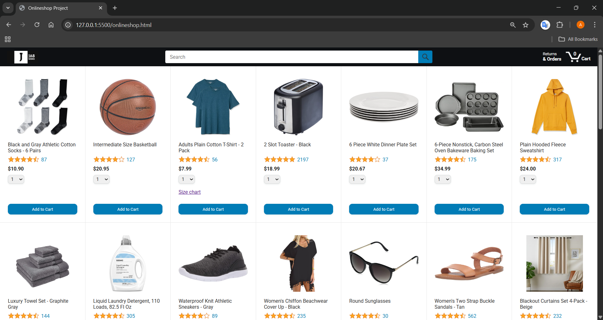
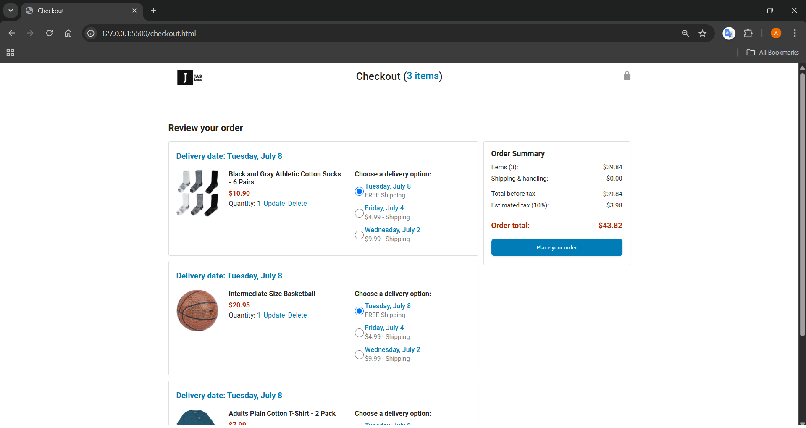
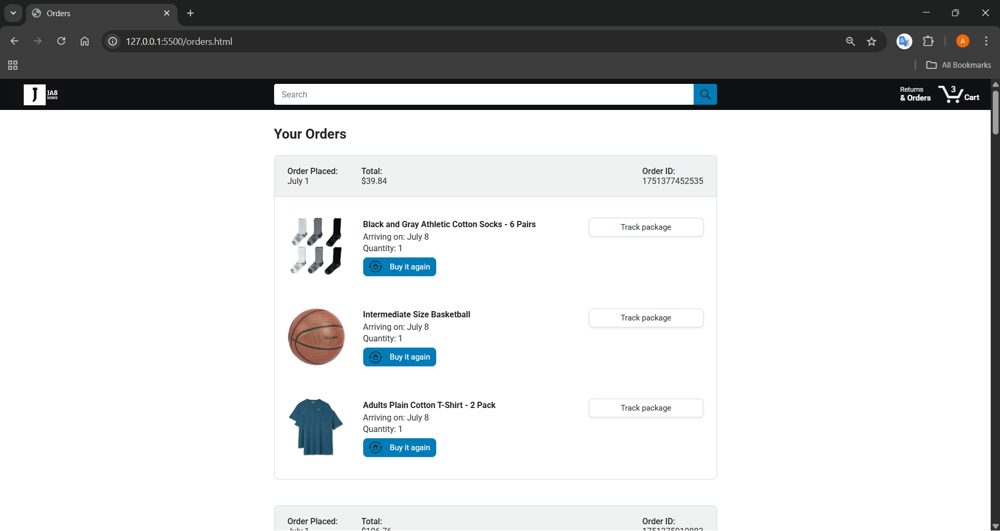
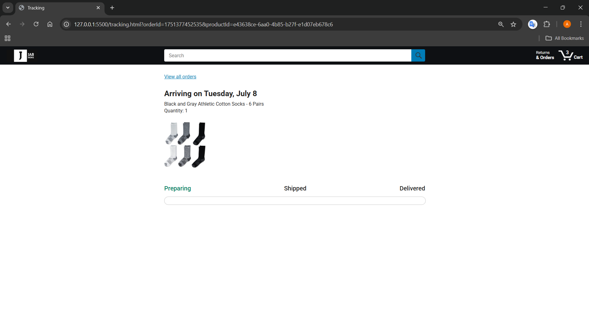

# Onlineshop Project

Dies ist ein einfaches Onlineshop-Projekt, das mit HTML, CSS und JavaScript umgesetzt wurde. Die Anwendung simuliert einen kleinen Online-Shop mit Produktübersicht, Warenkorb, Bestellübersicht und Sendungsverfolgung – komplett ohne Backend-Anbindung.

## Projektbeschreibung

Das Projekt bietet folgende Funktionen:

- **Produktübersicht:** Durchsuchen und filtern Sie Produkte.
- **Warenkorb:** Produkte können mit Mengenangabe in den Warenkorb gelegt werden.
- **Checkout:** Übersicht und Abschluss der Bestellung.
- **Bestellübersicht:** Anzeige aller bisherigen Bestellungen.
- **Sendungsverfolgung:** Verfolgen Sie den Status einzelner Bestellungen.
- **Lokale Speicherung:** Alle Daten werden im LocalStorage des Browsers gespeichert.

## Screenshots

products(`onlineshop.html`);

checkout(`checkout.html`):

orders(`orders.html`):

tracking(`tracking.html`):

## Anwendung steuern

- **Produkte suchen:** Nutzen Sie die Suchleiste oben, um Produkte nach Namen oder Stichworten zu filtern.
- **In den Warenkorb legen:** Wählen Sie die gewünschte Menge und klicken Sie auf „Add to Cart“.
- **Warenkorb anzeigen:** Klicken Sie auf das Warenkorb-Symbol oben rechts.
- **Bestellung abschließen:** Im Checkout können Sie die Bestellung abschließen.
- **Bestellungen ansehen:** Über „Returns & Orders“ gelangen Sie zur Bestellübersicht.
- **Sendung verfolgen:** In der Bestellübersicht können Sie für jede Bestellung die Sendungsverfolgung öffnen.

## Projekt von GitHub clonen und starten

1. **Repository clonen**
   - bash
   - git clone https://github.com/rahimi-ali786/onlineshop-project.git
  
2. **Projekt starten**
   - Ein direktes Öffnen im Browser ist **nicht möglich**
   - Öffne den Projektordner mit einem Code-Editor wie Visual Studio Code.
   - Starte die Datei `onlineshop.html` mit der Erweiterung **Live Server** (Rechtsklick auf die Datei und „Open with Live Server“ auswählen).

## Voraussetzungen
- Ein moderner Webbrowser (Chrome, Firefox, Edge, Safari)
- Optional: Ein Editor wie Visual Studio Code für Anpassungen

**Viel Spaß beim Ausprobieren!**